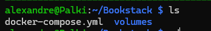

# BookStack - Migration

## Procedure

Pour migrer une instance BookStack, copier le dossier `volumes/` ainsi que les fichiers `docker-compose.yml` et `.env`.



Apres relance des conteneurs, verifier :

- Les identifiants de connexion
- La presence des documents
- L'affichage des images

Si les images n'apparaissent pas :

```bash
podman exec -it bookstack php /app/www/artisan bookstack:update-url https://<ANCIENNE_URL> https://<NOUVELLE_URL>
```
