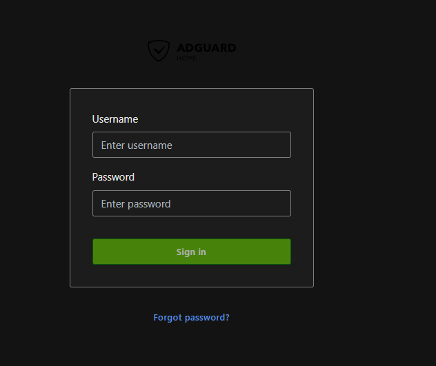
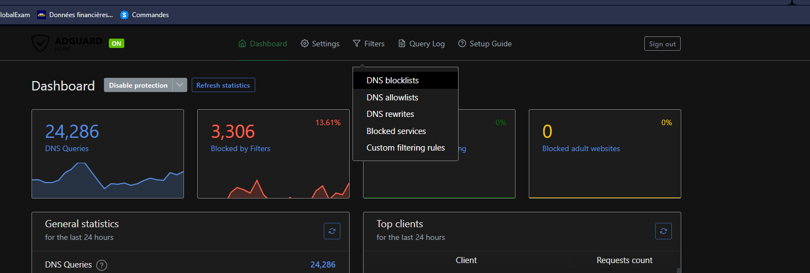
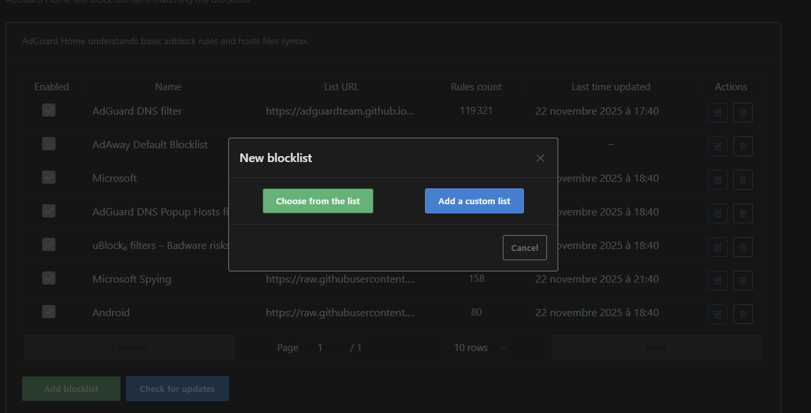
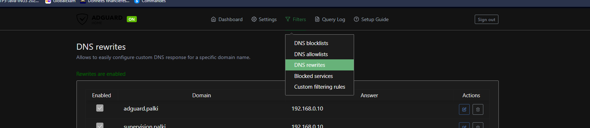
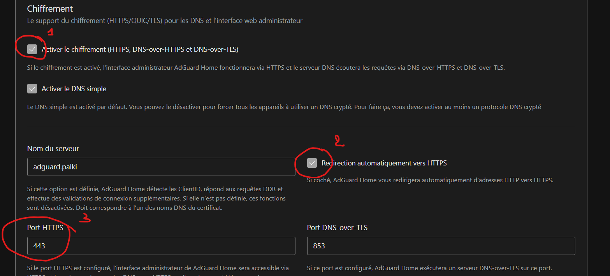

# AdGuard Home

Serveur DNS avec filtrage integre, utilise pour la resolution de noms de domaine internes et le blocage de domaines malveillants.

## Prerequis

- LXC ou VM avec Docker ou Podman installe
- Port 53 disponible sur l'hote

## Installation

### Avec Docker

Creer le fichier `docker-compose.yml` :

```yaml
services:
  adguardhome:
    image: adguard/adguardhome:latest
    container_name: adguardhome
    restart: unless-stopped
    ports:
      - "53:53/tcp"
      - "53:53/udp"
      - "9001:80/tcp"
      - "443:443/tcp"
      - "853:853/tcp"
      - "853:853/udp"
    volumes:
      - ./conf:/opt/adguardhome/conf
      - ./work:/opt/adguardhome/work
    environment:
      - TZ=Europe/Paris
```

> **Important** : Lors du premier lancement, autoriser egalement le port **3000** (page de creation du compte administrateur).

Demarrer le service :

```bash
docker compose up -d
```

### Avec Podman

```yaml
services:
  adguardhome:
    image: docker.io/adguard/adguardhome:latest
    container_name: adguardhome
    restart: unless-stopped
    ports:
      - "53:53/tcp"
      - "53:53/udp"
      - "3000:3000/tcp"
      - "9001:80/tcp"
      - "853:853/tcp"
      - "853:853/udp"
    volumes:
      - ./conf:/opt/adguardhome/conf
      - ./work:/opt/adguardhome/work
    environment:
      - TZ=Europe/Paris
```

#### Depannage Podman

Cockpit peut poser des problemes de lecture de fichiers. Attribuer les droits necessaires sur le dossier des volumes. Pour le port DNS 53 (port privilegie) :

```bash
# Autoriser les ports a partir de 53
echo 'net.ipv4.ip_unprivileged_port_start=53' | sudo tee -a /etc/sysctl.conf
# Appliquer
sudo sysctl -p
# Relancer sans sudo
podman-compose down
podman-compose up -d
```

## Utilisation

### Acces a l'interface

L'interface web est accessible via :
- `http://<IP_ADGUARD>:9001`
- `http://adguard.<DOMAIN>:9001` (si DNS configure)



### Blocage de noms de domaine

Se rendre dans **Filters > DNS Blocklists** :



Cliquer sur **Add blocklist** et choisir entre une liste preconcue ou des URLs personnalisees :



### Noms de domaine personnalises (DNS rewrite)

Pour creer des noms de domaine locaux, utiliser l'option **DNS rewrites** :



## Configuration HTTPS

### Creation du certificat

Generer un certificat auto-signe :

```bash
sudo openssl req \
  -x509 \
  -nodes \
  -days 365 \
  -newkey rsa:2048 \
  -keyout adguard.key \
  -out adguard.crt \
  -config adguard-cert.conf \
  -extensions v3_req
```

### Activation du HTTPS

Dans l'interface web : **Settings > Encryption Settings**



## Rappels de securite

- Changer le mot de passe administrateur par defaut
- Restreindre l'acces a l'interface web (port 9001)
- Utiliser HTTPS pour l'interface d'administration
