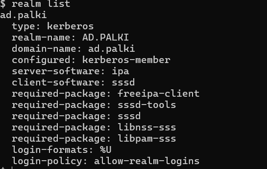
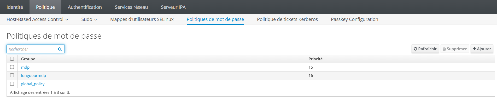
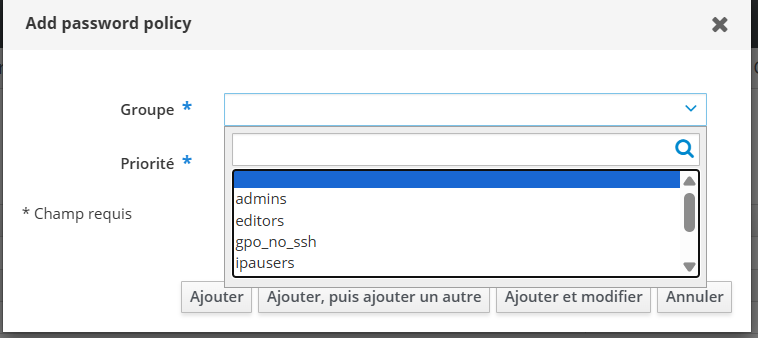
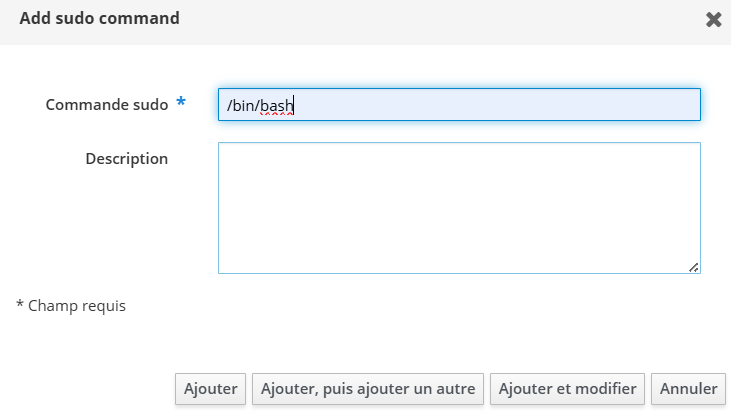
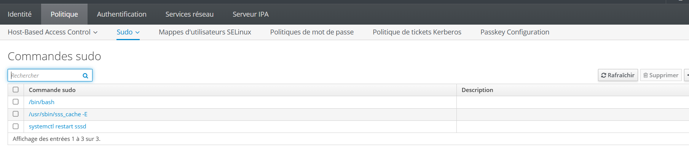
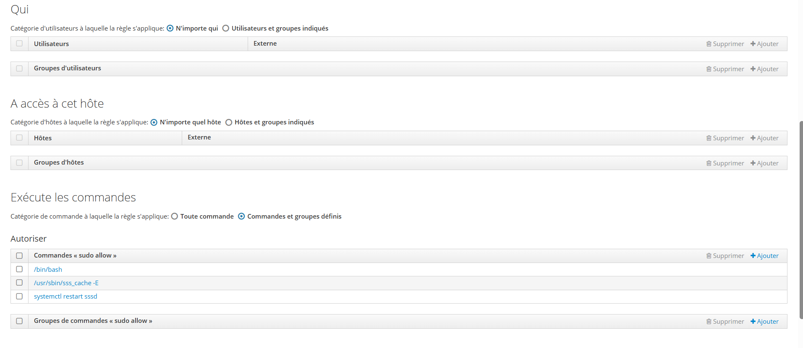

# FreeIPA - Administration

## Creation d'un administrateur

Dans l'interface web FreeIPA : **Utilisateurs > Utilisateurs actifs > Ajouter**.
Creer un utilisateur puis l'ajouter au groupe **admins** afin de lui attribuer les privileges d'administration.

### Rappels de securite

- Utiliser un compte administrateur distinct du compte personnel
- Activer des mots de passe forts et uniques
- Limiter l'appartenance au groupe **admins** au strict necessaire

Pour verifier la jonction depuis le client :

```bash
realm list
```



## Politique de mot de passe

Se rendre dans **Politique > Politique de mot de passe** :



Cliquer sur **Ajouter** et selectionner le groupe cible. La priorite est un chiffre : la valeur la plus elevee sera celle appliquee.



> **Note** : Par defaut, la politique `global_policy` s'applique a tous les utilisateurs avec une priorite de 0.

## Gestion des droits sudo

### Autoriser toutes les commandes sudo

Se rendre dans **Politique > Sudo > Regles sudo > Ajouter**.

Specifier les utilisateurs ou groupes concernes, puis les machines sur lesquelles les droits s'appliquent.

> **Note** : Par defaut, les droits sudo sont desactives.

### Autoriser des commandes specifiques

1. Aller dans **Politique > Sudo > Commandes sudo** et ajouter les commandes souhaitees :





2. Creer une regle sudo dans **Politique > Sudo > Regles sudo > Ajouter** :



> **Note** : Compter environ 10 minutes apres redemarrage du poste client pour que les regles sudo soient appliquees.
