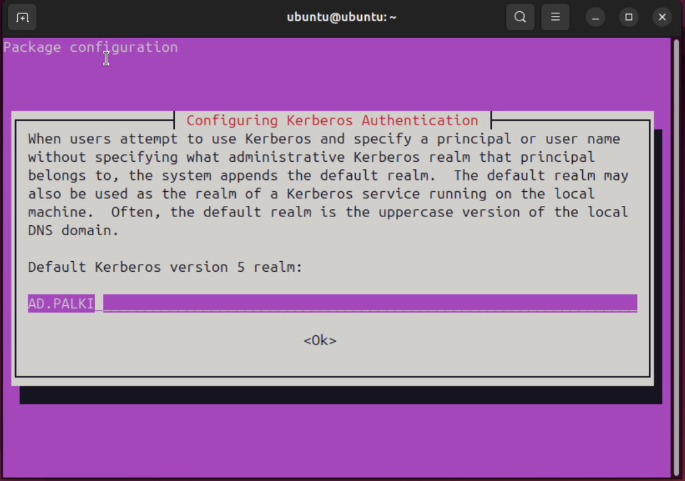
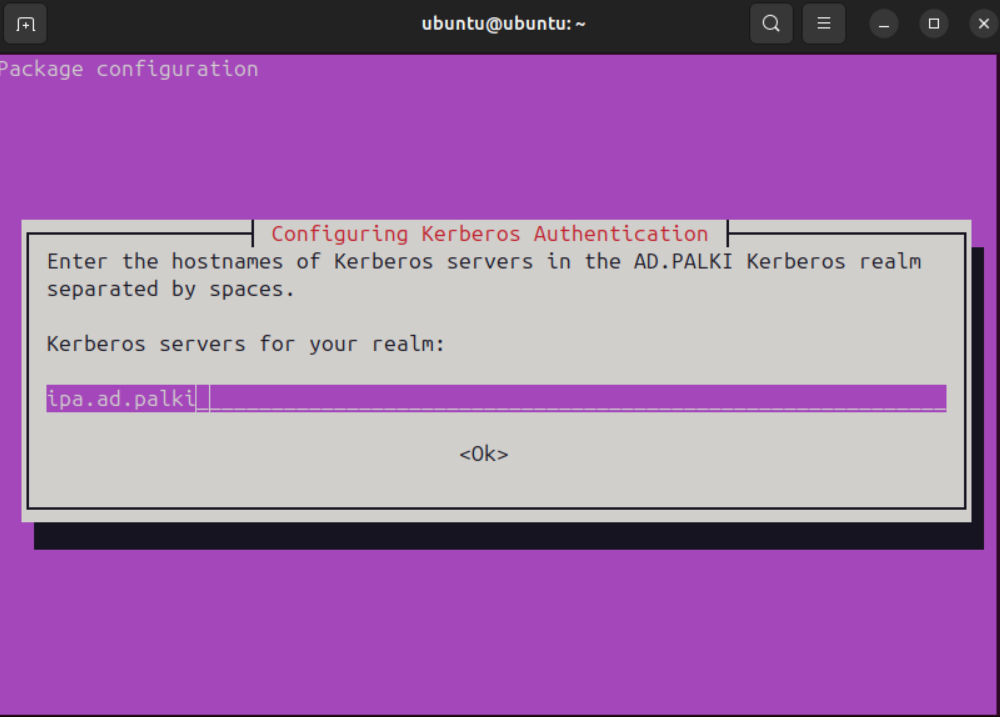
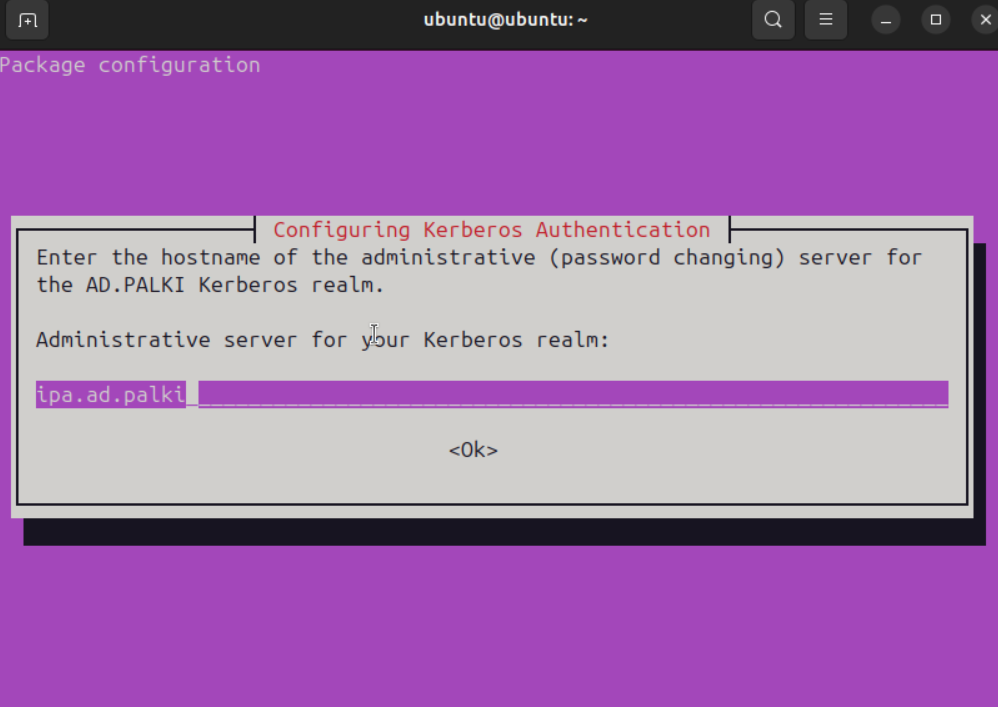
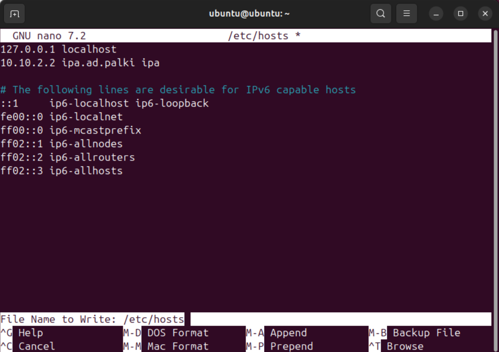
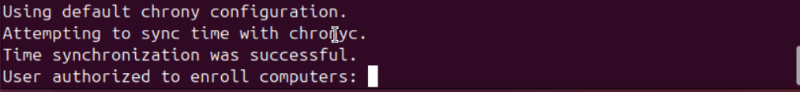

# FreeIPA - Joindre un poste client

## Prerequis client

Le poste client doit pouvoir resoudre le nom de domaine FreeIPA (DNS configure).

## Installation du client

```bash
sudo apt install freeipa-client
```



Renseigner le **realm** (ex : `AD.EXAMPLE.LOCAL`).



Renseigner le serveur Kerberos (ex : `ipa.<DOMAIN>`).



Renseigner le serveur administratif (ex : `ipa.<DOMAIN>`).

## Configuration du fichier hosts

Editer `/etc/hosts` et ajouter l'entree du serveur FreeIPA :

```bash
<IP_FREEIPA> ipa.<DOMAIN> ipa
```



## Modification du hostname

```bash
sudo hostnamectl set-hostname <NOM_POSTE>.<DOMAIN>
```

## Finalisation de la jonction

```bash
sudo ipa-client-install --mkhomedir
```

Informations a renseigner :

| Champ | Valeur |
|-------|--------|
| Domain Name | `<DOMAIN>` |
| IPA Server Name | `ipa.<DOMAIN>` |
| Fixed value DNS | yes |
| Reste | Valeur par defaut |

Confirmer avec **yes**.



Se connecter avec le compte administrateur du domaine.

## Rappels de securite

- Joindre uniquement des postes approuves au domaine
- Verifier le DNS avant la jonction pour eviter les detournements
