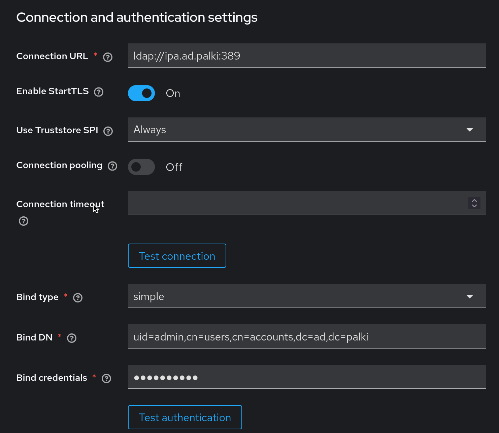
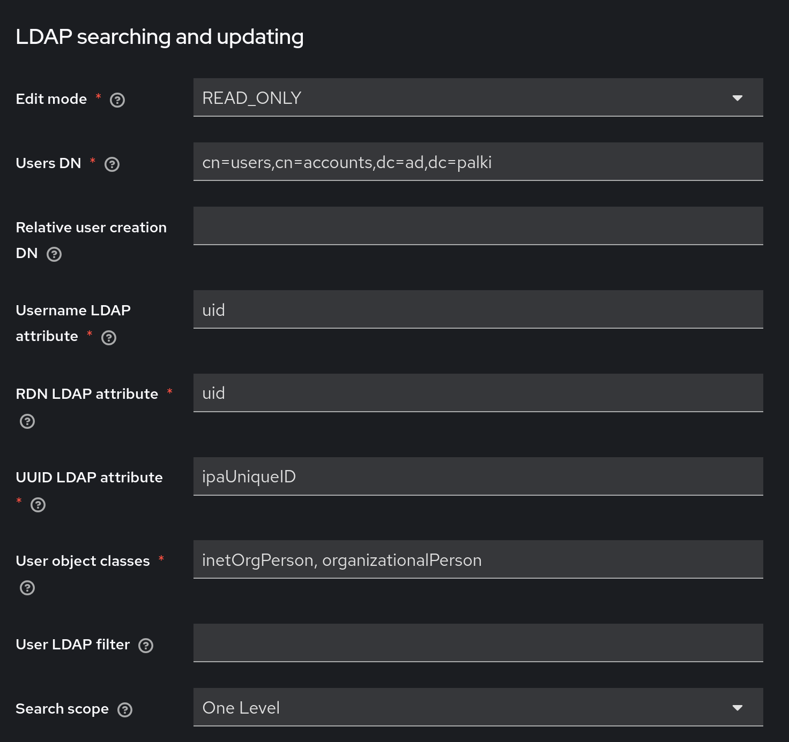
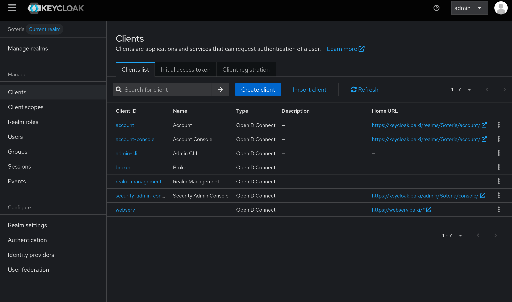
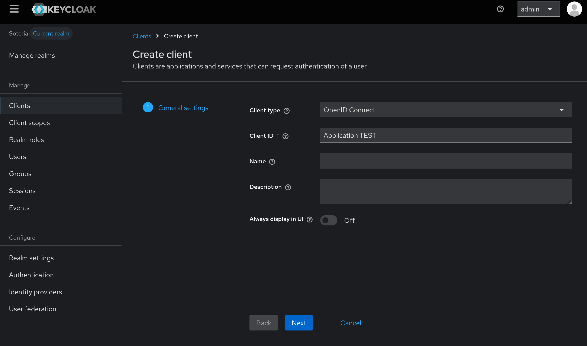
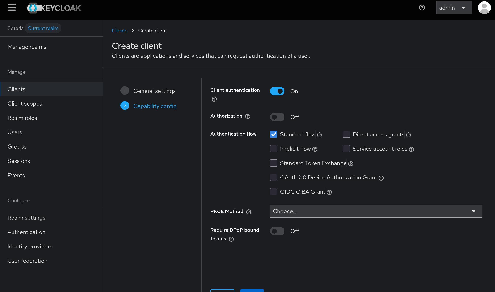
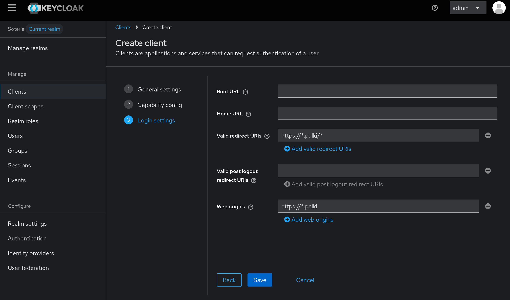
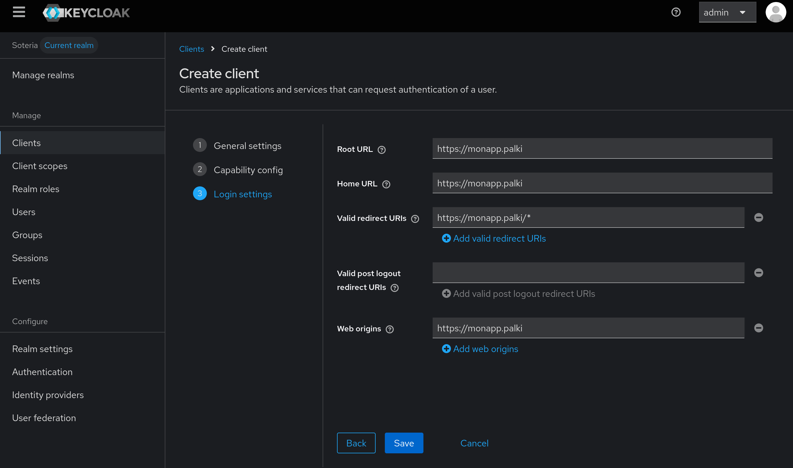

# Keycloak

Solution d'authentification et de gestion des identites permettant de mettre en place du Single Sign-On (SSO) via OpenID Connect. Keycloak se connecte a FreeIPA (LDAP) pour centraliser l'authentification des utilisateurs.

## Prerequis

- LXC ou VM avec Docker installe
- FreeIPA operationnel (pour la federation LDAP)
- Certificats si HTTPS requis

## Organisation des fichiers

```
/opt/keycloak/
├── docker-compose.yml
├── .env
├── freeipa-ca.crt
├── postgresql/
└── certs/
    └── keycloak.p12
```

## Installation

### Docker Compose

Creer le fichier `docker-compose.yml` :

```yaml
services:
  postgres:
    image: postgres:16
    container_name: keycloak-db
    restart: unless-stopped
    env_file:
      - .env
    volumes:
      - postgres_data:/var/lib/postgresql/data

  keycloak:
    image: quay.io/keycloak/keycloak:latest
    container_name: keycloak
    restart: unless-stopped
    env_file:
      - .env
    command: start
    ports:
      - "8080:8080"
    depends_on:
      - postgres

volumes:
  postgres_data:
```

### Variables d'environnement

Creer le fichier `.env` :

```
# PostgreSQL
POSTGRES_DB=keycloak
POSTGRES_USER=keycloak
POSTGRES_PASSWORD=CHANGE_ME

# Keycloak
KC_DB=postgres
KC_DB_URL=jdbc:postgresql://postgres:5432/keycloak
KC_DB_USERNAME=keycloak
KC_DB_PASSWORD=CHANGE_ME
KC_HOSTNAME=<KEYCLOAK_DOMAIN>
KC_PROXY=edge
KC_PROXY_HEADERS=xforwarded
KC_HTTP_ENABLED=true
KEYCLOAK_ADMIN=admin
KEYCLOAK_ADMIN_PASSWORD=CHANGE_ME
```

### Demarrage

```bash
docker compose up -d
```

> **Note** : Le premier demarrage peut prendre 5 a 10 minutes. L'interface d'administration est accessible sur le port 8080.

## Liaison a FreeIPA (LDAP)

1. Creer un **Realm** pour l'organisation
2. Se rendre dans **User Federation** et ajouter un provider **LDAP**
3. Remplir les champs selon la configuration de FreeIPA





4. Sauvegarder puis cliquer sur **Sync all users** dans le menu **Actions** pour importer les utilisateurs

## Activation HTTPS

### Generation du keystore PKCS12

Installer Java :

```bash
apt install -y openjdk-17-jdk
```

Generer le certificat :

```bash
keytool -genkeypair \
  -storetype PKCS12 \
  -keystore keycloak.p12 \
  -storepass "CHANGE_ME" \
  -keypass "CHANGE_ME" \
  -alias keycloak \
  -keyalg RSA \
  -keysize 2048 \
  -validity 3650 \
  -dname "CN=<KEYCLOAK_DOMAIN>, OU=IT, O=Keycloak, L=Lab, ST=Lab, C=FR"
```

> **Important** : Le CN doit correspondre au nom de domaine du service. Les valeurs de `keypass` et `storepass` doivent etre identiques.

## Creation d'un client (application)

### Procedure

1. Choisir le bon Realm, puis se rendre dans **Clients > Create Client**



2. Selectionner **OpenID Connect** et donner un nom au client



3. Activer **Client authentication** (position **On**)



### Configuration des URIs de redirection

**Cas multi-applications** (un client pour toutes les applications) :



**Cas mono-application** (un client par application) :



4. Dans l'onglet **Credentials**, recuperer le **Client Secret** necessaire pour la configuration d'OAuth2 Proxy

## Rappels de securite

- Remplacer tous les mots de passe par des valeurs fortes et uniques
- Activer HTTPS en production et limiter l'exposition publique du port d'admin
- Restreindre les clients et redirections autorisees aux domaines attendus
