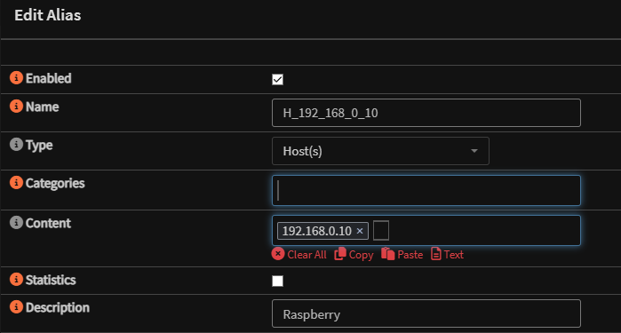
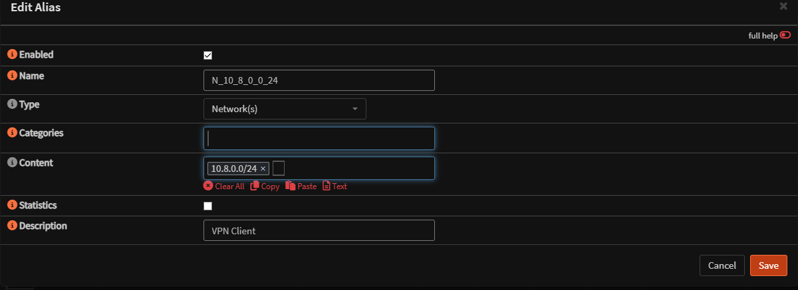
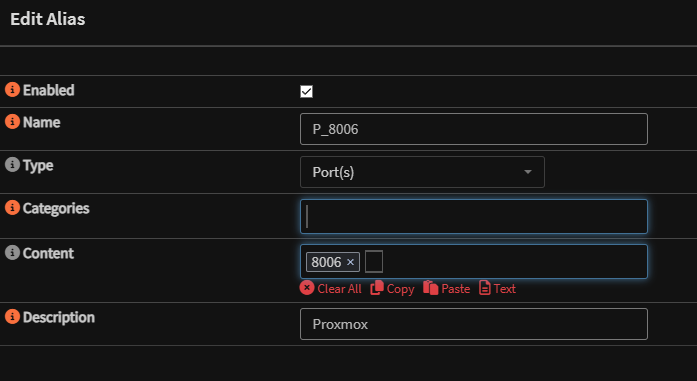
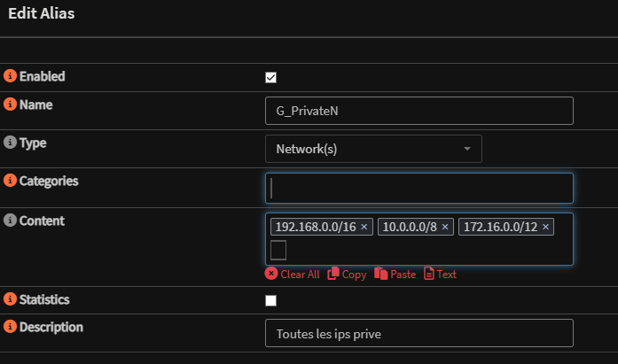

# OPNsense - Aliases et nomenclature

## Convention de nommage

Avant de creer des objets sur OPNsense, respecter la nomenclature suivante :

| Type | Format | Exemple |
|------|--------|---------|
| Sous-reseau | `N_X_X_X_X` | `N_10_10_2_0` |
| Hote | `H_X_X_X_X` | `H_10_10_2_2` |
| Port | `P_X` | `P_443` |
| Groupe sous-reseaux | `GN_Nom_du_groupe` | `GN_Serveurs` |
| Groupe hotes | `GH_Nom_du_groupe` | `GH_DNS` |
| Groupe ports | `GP_Nom_du_groupe` | `GP_Web` |

## Creation d'un alias

Se rendre dans **Firewall > Aliases** et cliquer sur le bouton **+**.

### Alias de type Hote

Entrer un nom suivant la nomenclature, selectionner le type **Host** et renseigner l'adresse IP :

### Alias de type Sous-reseau

Meme procedure, en renseignant l'adresse IP avec le CIDR :

### Alias de type Port

Indiquer le numero de port dans le champ **Content** :

### Alias de type Groupe

Regrouper plusieurs alias existants :

