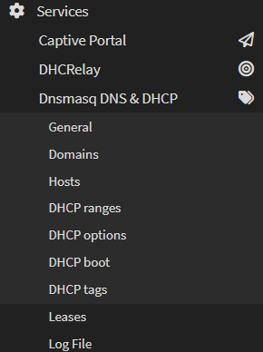
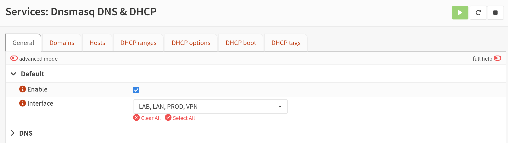
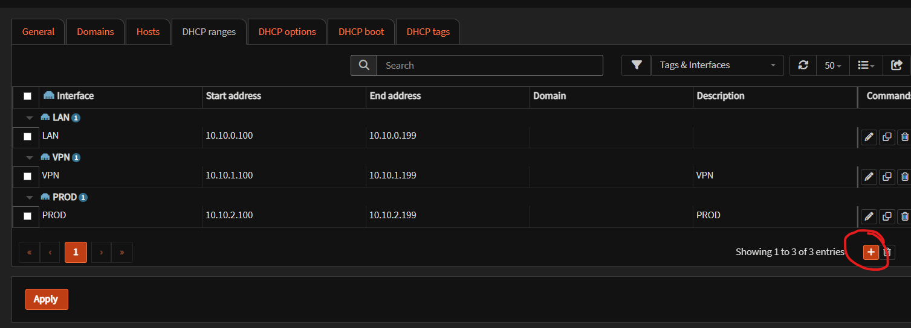
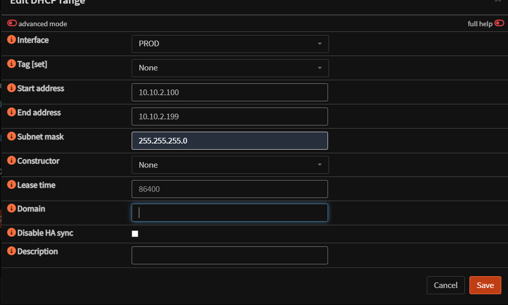
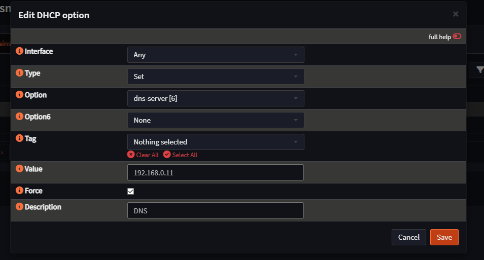

# OPNsense - DHCP et DNS

## DHCP

### Configuration

Se rendre dans **Services > DNSmasq DNS & DHCP > General** :

Selectionner l'interface sur laquelle activer le DHCP :

Dans **DHCP Range**, cliquer sur **+** et renseigner la plage d'adresses :

## DNS

Configuration du DNS :

