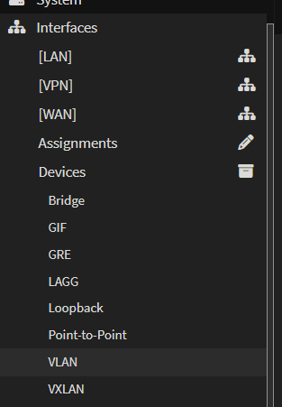
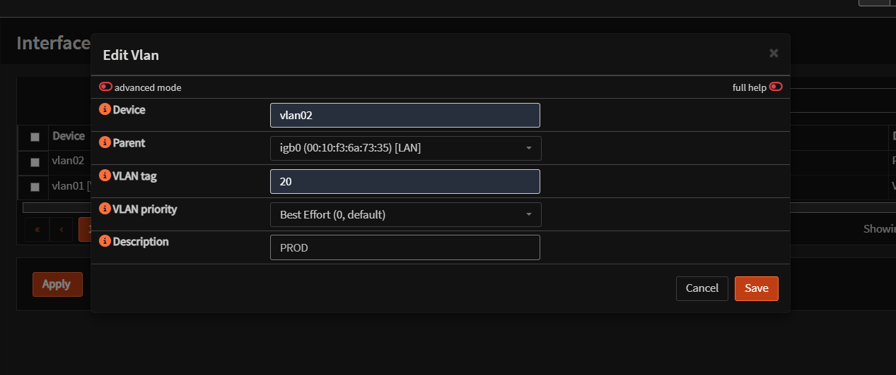
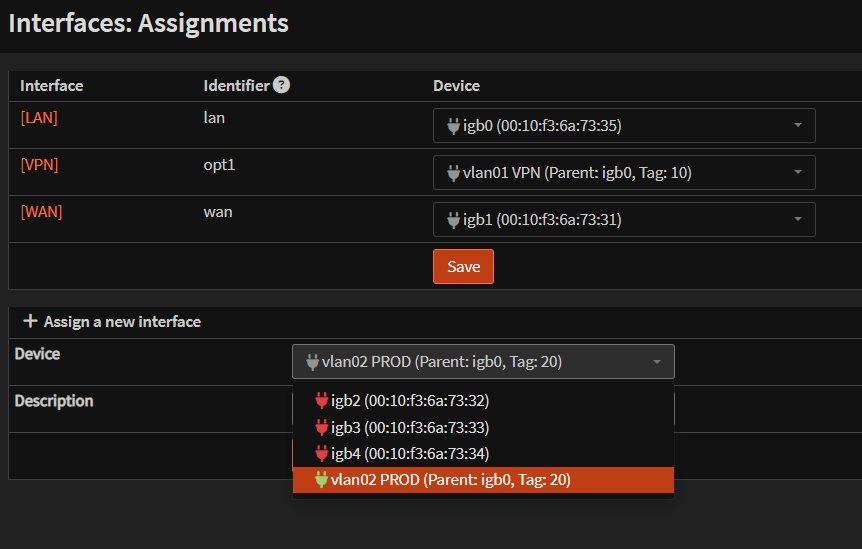
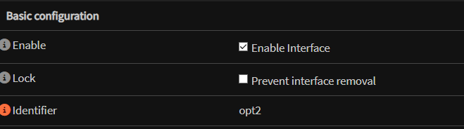
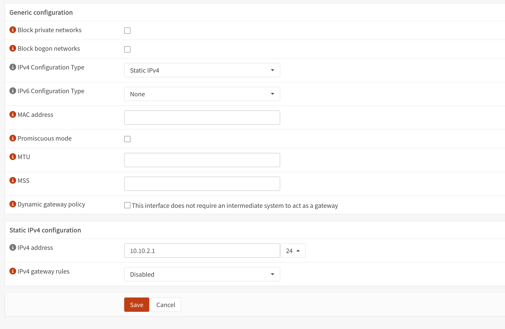

# OPNsense - VLAN

## Creation du VLAN

Se rendre dans **Interfaces > Devices > VLAN** :

1. Dans **VLAN TAG**, entrer un numero non utilise
2. Dans **Parent**, selectionner l'interface physique concernee

## Assignation de l'interface

Assigner le VLAN a une interface :

Activer l'interface en cochant **Enable** dans l'onglet correspondant :

Attribuer une IP statique correspondant au sous-reseau du VLAN :

