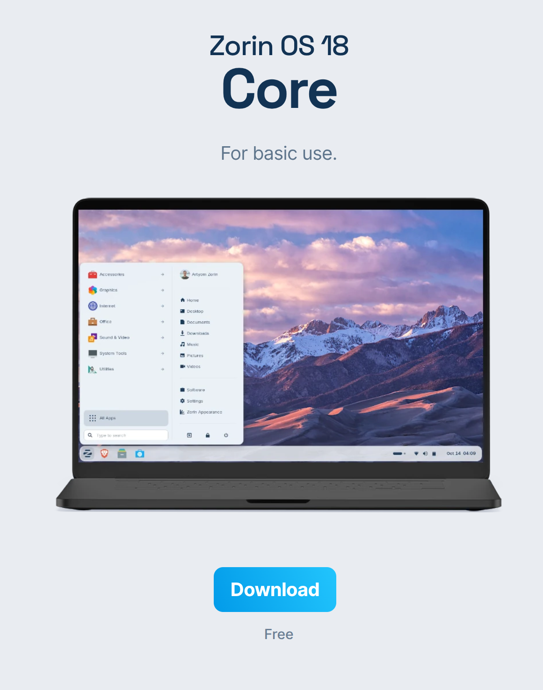
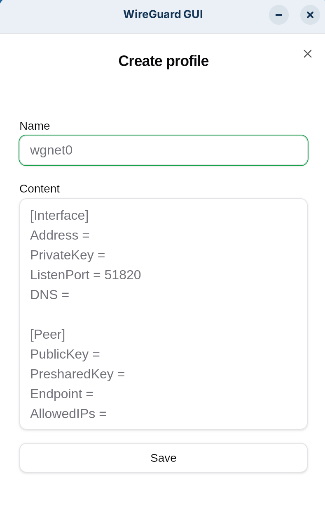

# Poste client - Zorin OS

Systeme d'exploitation Linux base sur Ubuntu, utilise comme poste de travail dans l'infrastructure.

## Prerequis

- Cle USB bootable
- ISO Zorin OS telecharge depuis le [site officiel](https://zorin.com/os/download/)

## Installation

### Preparation de la cle USB

Telecharger l'ISO depuis le site officiel :



#### Sous Linux (dd)

> **Attention** : La commande `dd` ecrit directement sur le peripherique. Verifier le chemin du peripherique avant execution pour eviter toute perte de donnees.

Identifier le peripherique cible :

```bash
lsblk -f
```

Flasher l'ISO :

```bash
sudo dd if=/chemin/vers/zorin.iso of=/dev/sdX bs=4M status=progress oflag=sync
```

Remplacer `/dev/sdX` par le peripherique identifie.

#### Sous Windows

Utiliser [Rufus](https://rufus.ie/).

#### Sous macOS ou Linux (alternative)

Utiliser [Balena Etcher](https://etcher.balena.io/).

### Procedure d'installation

Demarrer sur la cle USB et suivre la procedure d'installation graphique.

## Configuration du client WireGuard

### Prerequis

- Fichier de configuration WireGuard fourni par l'administrateur (voir [WireGuard VPN](../Wireguard%20VPN/wireguard-vpn.md))

### Installation

Installer les dependances et le client graphique [wireguard-gui](https://github.com/0xle0ne/wireguard-gui) :

```bash
sudo apt-get install javascriptcoregtk-4.1 libsoup-3.0 webkit2gtk-4.1 libayatana-appindicator3-dev librsvg2-dev wireguard resolvconf -y
```

Telecharger le dernier fichier `.deb` depuis les releases du projet et l'installer (double-clic ou `sudo dpkg -i <fichier>.deb`).

### Configuration

1. Cliquer sur **+** pour ajouter une configuration
2. Copier-coller le contenu du fichier de configuration WireGuard



3. Cliquer sur l'icone de la fusee pour se connecter

## Jonction au domaine FreeIPA

Pour joindre ce poste au domaine FreeIPA, se referer a la documentation [FreeIPA - Joindre un poste client](../FreeIPA/freeipa.md#joindre-un-poste-client-au-domaine).

## Rappels de securite

- Activer les mises a jour automatiques
- Chiffrer le disque si possible
- Ne jamais stocker de cle VPN non chiffree
