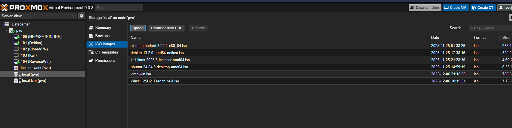
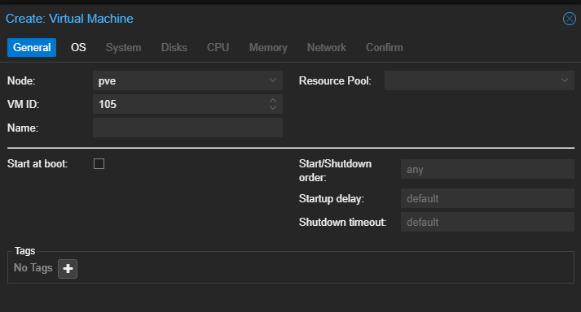
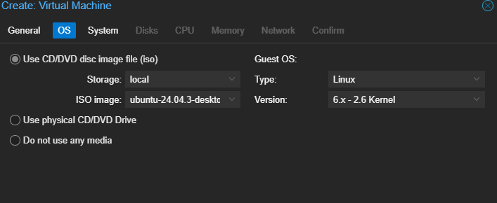
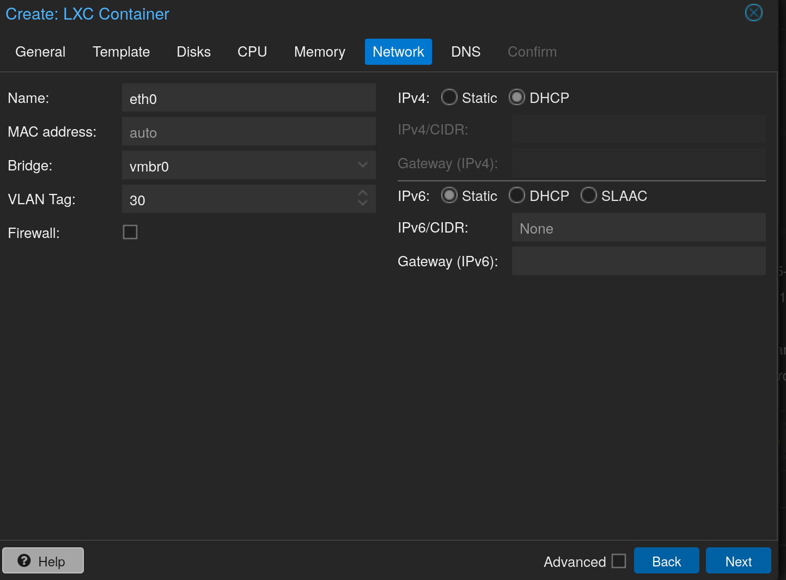

# Proxmox

Hyperviseur de virtualisation permettant de gerer les machines virtuelles (VM) et les conteneurs Linux (LXC) de l'infrastructure Soteria.

## Prerequis

- Serveur physique avec Proxmox VE installe
- Acces a l'interface web Proxmox (port 8006)

## Installation d'une VM

### Ajout de l'ISO

Pour creer une machine, il faut d'abord telecharger l'ISO sur le serveur. Se rendre dans **local(pve)** puis cliquer sur l'onglet **ISO Images**. Deux methodes sont disponibles :

- Telecharger depuis l'hote
- Telecharger depuis une URL



### Creation de la VM

Cliquer sur le bouton bleu **Create VM** en haut a droite de l'interface.



Dans **VM ID**, s'assurer que le numero n'est pas deja attribue. Apres avoir defini un ID et un nom, attribuer un OS parmi ceux precedemment telecharges :



> **Note** : Utiliser generalement les parametres par defaut. Certaines VM (ex : Windows) peuvent necessiter des configurations specifiques.

## Configuration de la carte reseau

### Carte reseau virtuelle (bridge)

Pour configurer la carte reseau du Proxmox, il faut associer une carte reseau virtuelle (bridge) a la carte reseau physique. La configuration se fait dans le fichier `interfaces` :

```bash
nano /etc/network/interfaces
```

Exemple de configuration :

```
auto lo
iface lo inet loopback

iface ens1f0 inet manual

iface eno1 inet manual

iface eno2 inet manual

auto vmbr0
iface vmbr0 inet static
        address <IP_PROXMOX>/<MASK>
        gateway <IP_GATEWAY>
        bridge-ports eno1
        bridge-stp off
        bridge-fd 0
        bridge-vlan-aware yes
        bridge-vids 2-100

iface ens1f1 inet manual

source /etc/network/interfaces.d/*
```

Redemarrer le service reseau :

```bash
sudo systemctl restart networking
```

> **Attention** : Adapter les noms d'interfaces (`eno1`, `ens1f0`, etc.) a votre materiel. Verifier avec `ip link show`.

## Creation d'un conteneur Linux (LXC)

### Telechargement des templates

Mettre a jour la liste des templates disponibles :

```bash
pveam update
```

Lister les images disponibles :

```bash
pveam available
```

Telecharger le template souhaite :

```bash
pveam download local <nom_image>
```

### Creation du conteneur

Suivre la procedure de creation de conteneur via l'interface web. Pour la configuration :

- **Ressources** : Estimer les besoins du service qui sera execute
- **Reseau** : Preciser le tag VLAN et selectionner DHCP en IPv4
- **Firewall** : Decocher la case Firewall (gere par OPNsense)



## Rappels de securite

- Restreindre l'acces a l'interface Proxmox (VPN ou VLAN d'administration)
- Activer l'authentification forte si disponible
- Appliquer les mises a jour systeme regulierement
