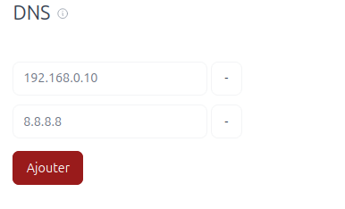
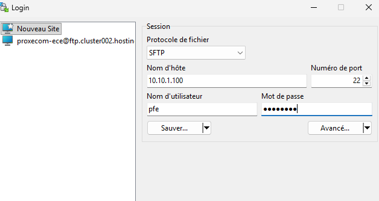
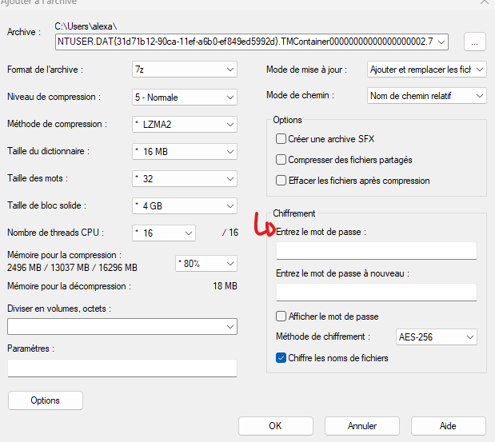
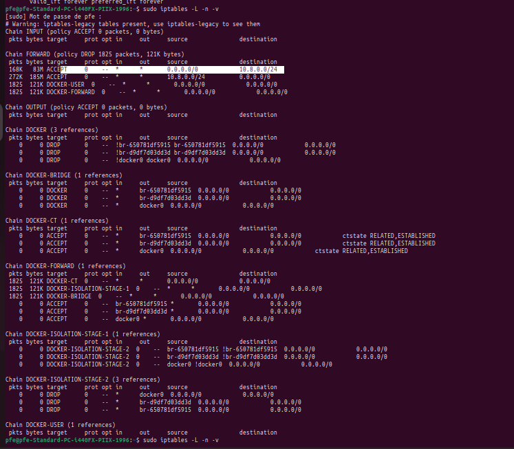
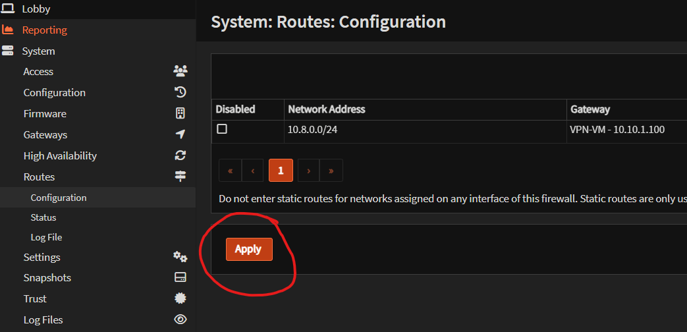

# WireGuard VPN

VPN permettant l'acces securise a l'infrastructure depuis l'exterieur. L'interface de gestion web permet de creer et gerer les configurations client.

## Prerequis

- VM dediee avec Docker installe
- Regles de routage configurees sur OPNsense

## Installation (wg-easy)

Pour simplifier la gestion, WireGuard est deploye via **wg-easy**.

```bash
docker run -d \
  --name=wg-easy \
  -e WG_HOST=<PUBLIC_IP_OR_DNS> \
  -e PASSWORD=CHANGE_ME \
  -v ~/.wg-easy:/etc/wireguard \
  -p 51820:51820/udp \
  -p 51821:51821/tcp \
  --cap-add=NET_ADMIN \
  --cap-add=SYS_MODULE \
  --sysctl="net.ipv4.ip_forward=1" \
  --sysctl="net.ipv4.conf.all.src_valid_mark=1" \
  ghcr.io/wg-easy/wg-easy
```

L'interface de gestion est accessible en local sur :

```
http://localhost:51821
```

### Rappels de securite

- Changer `PASSWORD` apres la premiere connexion
- Utiliser un mot de passe long et unique
- Restreindre l'acces au port 51821 (interface web) au reseau d'administration

## Gestion des clients

### Acces a l'interface de gestion

L'interface de gestion est accessible **uniquement en local** via Proxmox :

```
http://localhost:51821
```

### Ajouter un client

1. Cliquer sur **Nouveau** et definir une date d'expiration
2. Attribuer manuellement une IP non utilisee dans la plage `10.8.0.0/24`
3. Configurer le DNS (par defaut : `1.1.1.1`, ou le DNS interne en primaire)



4. Confirmer en cliquant sur **Sauvegarder**

### Supprimer un client

Editer l'utilisateur puis cliquer sur **Delete**.

### Modifier le DNS

Si l'on souhaite modifier le DNS d'un client, il faut recreer un fichier `.conf`.

### Recuperer le fichier de configuration

Se connecter en SSH a la machine WireGuard ou utiliser WinSCP :



> **Important** : Pour un transfert a distance, chiffrer le fichier de configuration. Utiliser un gestionnaire de mots de passe pour generer un mot de passe a usage unique, puis chiffrer avec 7-Zip :



## Redemarrage et depannage

### Redemarrage de la VM WireGuard

Apres un redemarrage de la VM, verifier que les regles de NAT sont presentes :



Si necessaire, reajouter les regles :

> **Attention** : Commandes a executer uniquement en environnement de laboratoire.

```bash
sudo iptables -A FORWARD -s 0.0.0.0/0 -d 10.8.0.0/24 -j ACCEPT
sudo iptables -A FORWARD -s 10.8.0.0/24 -d 0.0.0.0/0 -j ACCEPT
```

### Redemarrage du pare-feu ou de Proxmox

Si le VPN ne fonctionne plus apres un redemarrage d'OPNsense ou de Proxmox, actualiser la route vers le reseau VPN :

```bash
route add -net 10.8.0.0/24 <IP_VM_WIREGUARD>
```

Ou via l'interface graphique d'OPNsense :


